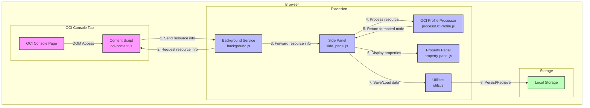
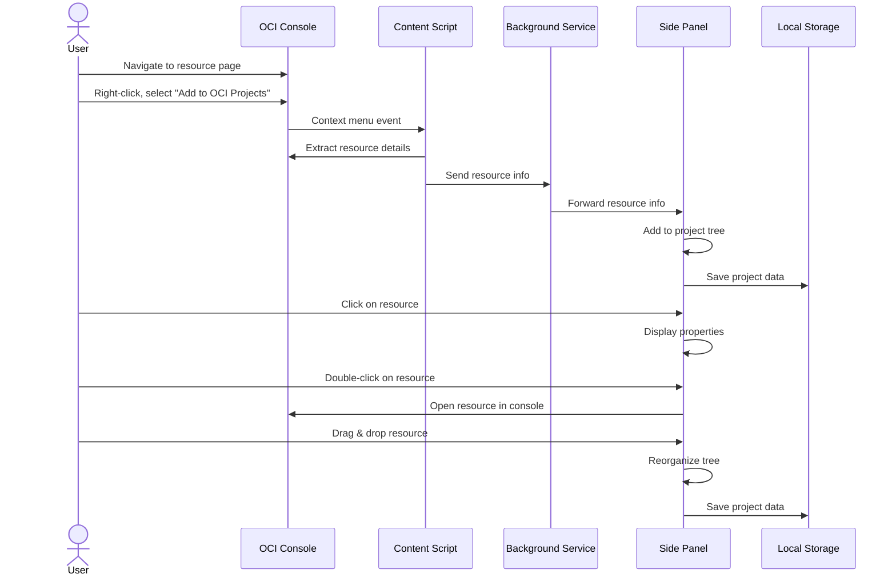
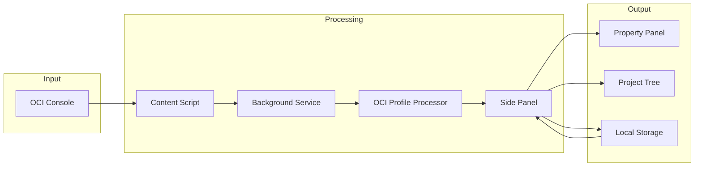

# OCI Projects Extension - Component Diagram

## Visual Component Architecture

## User Interaction Flow

## Data Flow Diagram

## Component Responsibilities

| Component | Primary Responsibility | Secondary Responsibility |
|-----------|------------------------|--------------------------|
| Background Service | Context menu management | Message routing |
| Content Script | Resource data extraction | DOM parsing |
| Side Panel | Tree visualization | User interaction handling |
| Property Panel | Property display | - |
| OCI Profile Processor | Data transformation | Resource type mapping |
| Utilities | Storage management | GUID generation |

## Extension Permissions

| Permission | Purpose |
|------------|---------|
| contextMenus | Create and manage right-click menu items |
| activeTab | Access the current tab's content |
| scripting | Execute scripts in the context of web pages |
| sidePanel | Display the project tree in a side panel |
